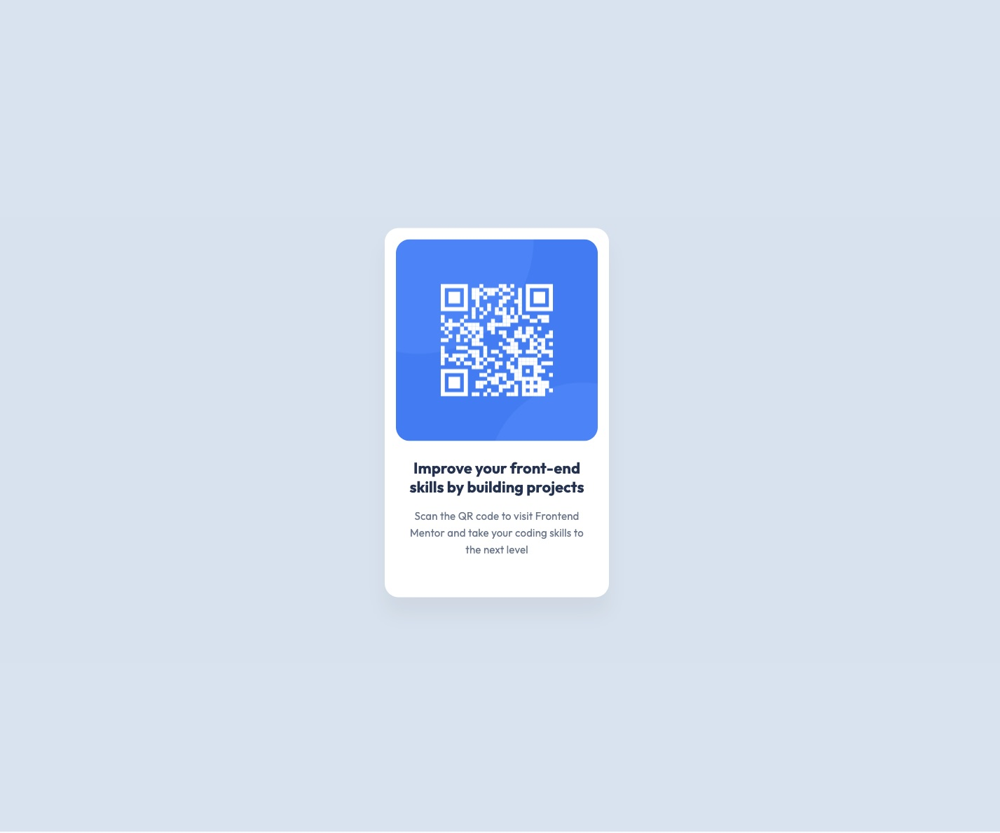

# Frontend Mentor - QR code component solution

This is a solution to the [QR code component challenge on Frontend Mentor](https://www.frontendmentor.io/challenges/qr-code-component-iux_sIO_H). Frontend Mentor challenges help you improve your coding skills by building realistic projects.

## Table of contents

- [Overview](#overview)
  - [Screenshot](#screenshot)
  - [Links](#links)
- [My process](#my-process)
  - [Built with](#built-with)
  - [What I learned](#what-i-learned)
  - [Continued development](#continued-development)

## Overview

### Screenshot




### Links

- Solution URL: [GitHub](https://github.com/Ayako-Yokoe/qr-code-component-main)
- Live Site URL: [GitHub](https://github.com/Ayako-Yokoe/qr-code-component-main)

## My process

### Built with

- Semantic HTML5 markup
- CSS custom properties

### What I learned

By using height: 100vh; along with flexbox and justify-content: center;, we can center the card without needing to set top, left, and use transform: translate(-50%, -50%);.

To see how you can add code snippets, see below:

You can use this:

```css
body {
...
  height: 100vh;
}
```

Instead of this:

```css
position: absolute;
top: 50%;
left: 50%;
transform: translate(-50%, -50%);
```

### Continued development

I’d like to continue learning about positioning with simpler code.
